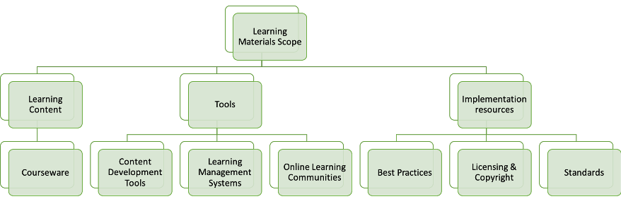
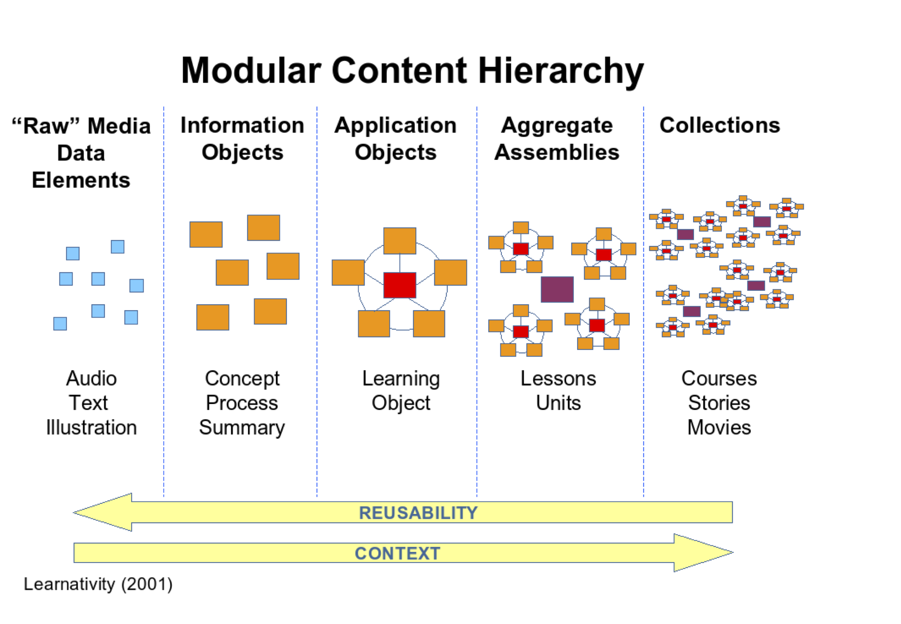
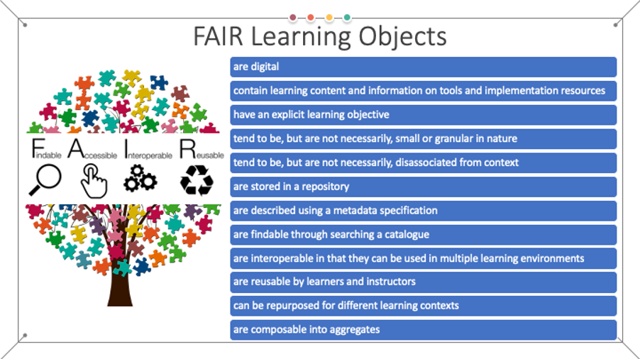

# Learning materials description and modelling

To ensure a consistent, yet flexible, approach to the development of a FAIR-by-design methodology for EOSC related learning materials, a well-defined scope and modelling of learning materials are needed. This chapter is a formal introduction to the theories and frameworks that one can use to apply the FAIR principles to new or pre-existing EOSC learning materials.

Herein, we adopt the definition of learning materials or learning resources as any types of materials that are used to support and enhance, directly or indirectly, learning and teaching [@R18] with their main goal being to help achieve the desired learning objectives (i.e. attain a set of learning outcomes). Note that in the general literature learning resources are also known as teaching-learning material, instructional materials or teaching aids. It has been shown that the utilisation of a large assortment of learning materials improves comprehension and improves the ability to learn in both group or independent setting, on premises or online [@R19]. Hence, today there are many different types of learning materials including:

- printed materials such as handouts and manuals; 
- audio-visual materials such as slides, images, videos, podcasts, and other multimedia; 
- interactive materials in the form of learning applications on computers, tablets or smartphones such as quizzes and games among others; 

all of which are used in the instructional activities, including active learning and assessment. In line with the EOSC vision and the overarching digital transformation, the main focus of the FAIR-by-design methodology is on the digital learning materials. Digital materials are essential not only in the e-learning environment, but also in the more traditional learning settings such as classrooms, face to face trainings and workshops; all of which are seen as a potential learning venue within the EOSC ecosystem. 

In addition, in line with [@R20], the full scope of learning materials is considered to include:

- Learning content, such as courses, modules, learning units, etc. This includes all types of courseware such as learning materials, presentations, guides, case studies, activities, quizzes, etc.
- Tools that represent the software necessary to develop, use and deliver the learning content such as learning management systems, content development tools, online learning communities, etc. 
- Implementation resources that are needed to support the development and promotion of the learning content such as best practices guides, licensing and copyright used for promotion and reuse, publishing standards, etc.  
This entails that each learning resource needs to be accompanied together with the corresponding tools for its design and consumption as well as well-defined conditions for its use as presented in Fig. 1.

<figure markdown>
  
  <figcaption>Fig. 1 - Learning materials scope</figcaption>
</figure>

One of the main decisions that need to be made when ensuring FAIRness of learning materials is to define the level of granularity on which the FAIR principles will start to be applied for a given set of learning materials. In other words, the main question is what is the minimum sized package of digital learning materials that is to be subjected to the FAIR principles? Is it a course (or training), a unit within a course (session within the training), or a single digital resource? If the granularity is too high, then there is a large overhead of metadata provisioning and cataloguing for a vast amount of FAIR learning resources with very little context related to them. On the other hand, low granularity will significantly reduce the effort of cataloguing, but also the possibility to combine different learning resources in order to create new learning content out of existing learning materials due to the inability to adopt only selected parts of a given material. To ensure flexibility and minimise the overhead, the minimum viable package of learning materials on which one can apply the FAIR-by-design methodology is based on the instructional design concept of learning object [@R21].

Thus, in the most general sense, we define a FAIR learning object as any FAIR digital resource that supports learning developed around a single learning objective. At the very core of this approach is the idea that the learning object, accompanied with suitable descriptive metadata, can be used as a common building block for the development of more complex learning content by reusing it, re-purposing it, and potentially revising it. 

Furthermore, to facilitate the reuse of learning objects, the best practice is to define a learning object as a package of a lesson, activity and assessment with a concrete learning outcome. Note that a similar approach is adopted in the OER community [@R22]. Other communities put even more heavy requirements on the minimum content of a learning object. Following the best practices presented in [@R23], a learning object should include:

- Meaningful title (and subtitle);
- Single, specific learning objective;
- Target audience;
- Time required to complete the content;
- Guide for instructors and learners; 
- Learning content;
- Self-evaluation;
- Final test to be used for formal evaluation.

Using this approach, the process of combining FAIR learning objects into higher level FAIR learning resources can be conceptualised in a fashion similar to the well-known Learnativity aggregation model (Fig. 2). The most granular element in the system is a raw data element that represents a single digital file with no context. Once the learning context such as a summary or concept description is provided for this file, it transforms into an information object. One or more information objects that provide the learning content around one learning objective become a learning object. These objects can then be combined into different aggregates or assemblies to define lessons, or units, which are in turn combined into collections that can represent courses or learning paths. By defining the learning object as the minimum resource to which we apply the FAIR principles, one avoids the necessity to make raw elements and information objects FAIR, while enabling the creation of FAIR aggregates and collections of various sizes and complexities. In other words, the FAIR principles for learning materials should not be applied to raw elements or simple information objects, but to learning objects and/or their aggregates. This will ensure that the FAIR learning material can be developed as a stand-alone with enough context for its intended use, but also reuse by others. Applying FAIR to lower levels than a learning object will generate too much overhead in terms of time and effort, while losing the major aspects of learning materials such as learning objective.

<figure markdown>
  
  <figcaption>Fig. 2 - Learnativity aggregation model [@R24]</figcaption>
</figure>

In this sense, learning objects aim to facilitate FAIRness of learning materials by enabling the design of small self-contained units of learning content that can be then reused in different courses and other learning materials or even large programmes. Following these concepts, FAIR learning objects exhibit the following characteristics:

- **Findable** – the learning object is the lowest hierarchical level of findability of learning materials in the EOSC ecosystem and is thus the lowest hierarchical level that can be described with metadata and catalogued; 
- **Accessible** – the full scope (content, tools and implementation resources) of the learning object should be accessible to both learning producers and consumers in the EOSC ecosystem;
- **Interoperable** – with a well-chosen scope (content, tools and implementation resources), the learning object can be consumed on multiple platforms; 
- **Re-usable** – each learning object can be put in a wider context based on the specific learning requirements of a particular aggregate course, unit or module in the EOSC ecosystem.

Note that the definition of the aggregation model is such that these characteristics are also applicable to any higher-level aggregation of FAIR learning objects. 

This approach to composability of learning objects is well aligned with other efforts such as the IEEE LOM [@R25] wherein there are four levels of granularity:

- L1 – a unit of learning, atomic material, indivisible learning material such as an image;
- L2 – a collection of L1 objects, i.e. lesson, such as a web page that is a set of an HTML file and a number of images;
- L3 – a collection of L2 objects, i.e. course, such as a web site with a number of pages;
- L4 – highest level of granularity, such as study programme or learning path obtained as a collection of L3 and/or L4 objects.

The FAIR learning object in this case corresponds to the L2 granularity.

Similarly, the Shareable Content Object Reference Model (SCORM) [@R26] that represents a collection of standards that aim to promote interoperable, accessible, and re-usable learning content defines a content model that consists of:

- Assets – smallest piece of learning content; 
- Shareable Content Objects (SCOs) – aggregation of assets that communicates with a virtual learning environment;
- Content aggregation – structured map of learning resources.

The SCORM content aggregation is composed of assets, SCOs, definition of their order and metadata that describes the entire aggregation and its individual components. Thus, in the proposed model, a SCORM content aggregation can be considered to correspond to a FAIR learning object.

<figure markdown>
  
  <figcaption>Fig. 3 - FAIR learning objects characteristics</figcaption>
</figure>

In summary, the FAIR-by-design methodology strives to ensure the implementation of the following specific characteristics of FAIR learning objects (Fig. 3):

- FAIR learning objects are digital;
- FAIR learning objects contain learning content and information on tools and implementation resources;
- FAIR learning objects have an explicit learning objective;
- FAIR learning objects tend to be, but are not necessarily, small or granular in nature;
- FAIR learning objects tend to be, but are not necessarily, disassociated from context;
- FAIR learning objects are stored in a repository;
- FAIR learning objects are described using a metadata specification;
- FAIR learning objects are findable through searching a catalogue;
- FAIR learning objects are interoperable in that they can be used in multiple learning environments;
- FAIR learning objects are reusable by both other instructors and learners;
- FAIR learning objects can be repurposed for different learning contexts;
- FAIR learning objects are composable into aggregates.
