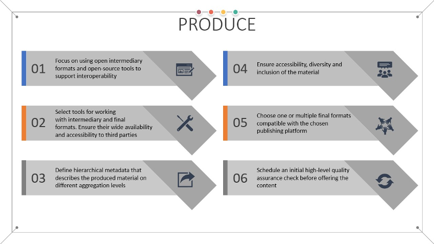
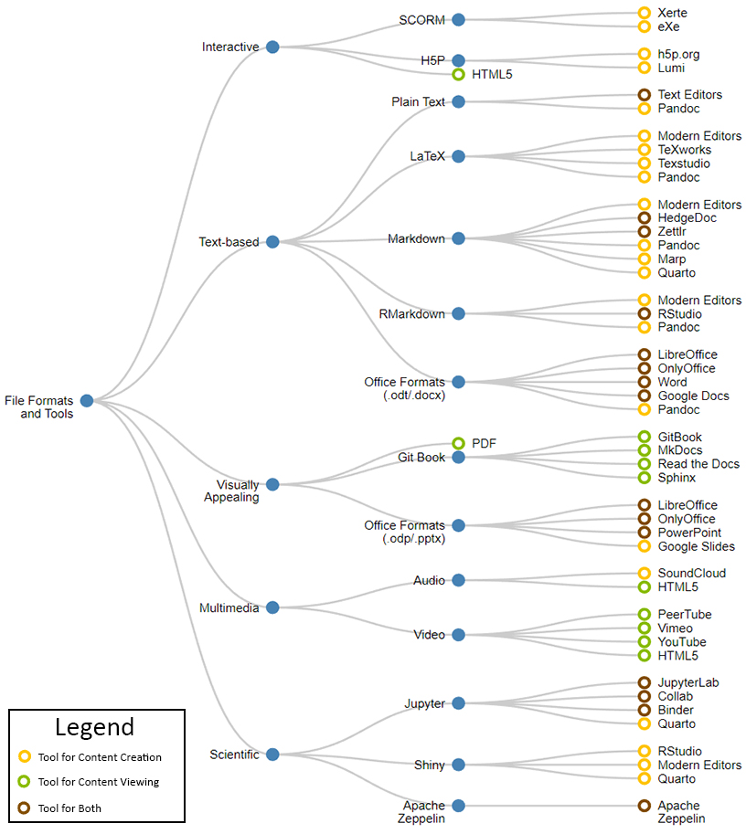
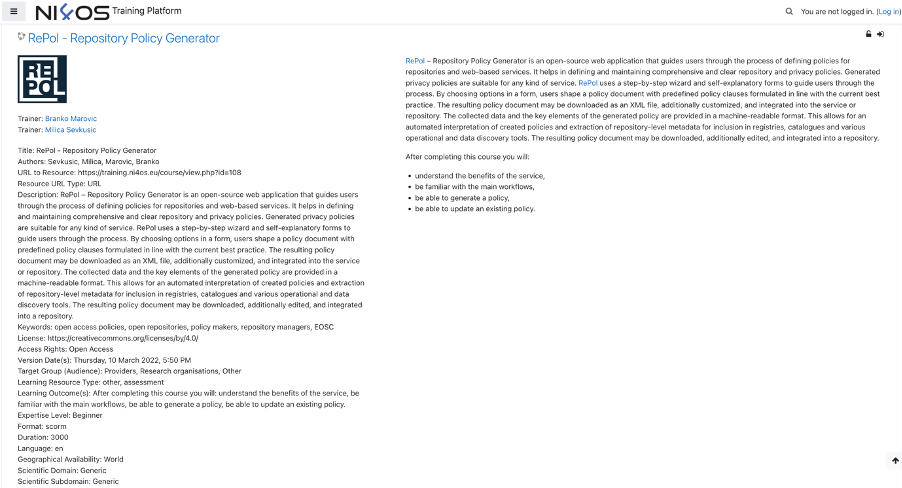

<figure markdown>
  
  <figcaption>Fig. 10 - Main goals of the produce stage</figcaption>
</figure>

The next step after creating the syllabus and defining the overall structure of the course is to develop the new learning objects themselves. Throughout this activity, there are three important aspects which need to be taken into consideration:

- The intermediary and final file formats of the produced learning objects;
- The required software tools for producing and consuming the learning objects;
- Ensuring future-proof compatibility and longevity of the learning objects.

In the subsections that follow, it is discussed how each of these aspects relate to the FAIR principles. A taxonomy of file formats for learning objects, along with examples of tools which can be used to either create or consume the output is also provided to further support the development activities.

## File formats for learning objects

Selecting the appropriate file formats for the learning objects is very important and can have a large impact on the overall experience that the end-users have during the learning process. As new, feature-rich, and interactive forms of content appear, it is a common occurrence for the final output format to be different than the intermediary one. The intermediary file format is the format which is used during the development phase of the learning objects. Once completed, additional tools can be used to convert this intermediary format to its final representation, which is most often no longer manually editable. Both the intermediary and final formats need to be chosen with care, since a restrictive or proprietary choice might limit the number of people who can contribute to the content during its development or make the final output inaccessible due to the lack of supported software client applications.

<figure markdown>
  
  <figcaption>Fig. 11 - Taxonomy of file formats and tools</figcaption>
</figure>

Depending on the nature of the learning objects, their domain area, and the technical proficiency of the content creators, a number of popular file formats exist today, such as: SCORM, H5P, various text-based formats, PDFs, multimedia, scientific notebooks, or even complete e-books accessible on-the-go. To better visualize the available options, Fig. 11 presents a taxonomy of file formats along with potential tools which can be used either for development or consumption. The file formats are divided into 5 distinct categories, based on their characteristics, interactivity level, content type and domain: 

- Interactive, 
- Text-based, 
- Visually Appealing, 
- Multimedia, and
- Scientific. 

The interactive category is comprised of three file formats: SCORM, H5P, and HTML5. Both SCORM and H5P are dedicated file formats for learning objects and enjoy wide ranging support from learning management systems (LMS) today, making them a popular choice. The main benefits of using a file format from this category is the high level of interactivity that can be achieved, since various activities can be directly embedded in the content itself, such as quizzes, interactive maps, videos, audio, and animations, thus providing a cohesive, all-in-one experience to self-paced learners in an asynchronous learning environment. With advancements made in terms of web standards in recent years, all modern web browsers support the consumption of both SCORM and H5P resources, since their final representation is HTML5, in the majority of cases. Technically proficient educators can also opt to develop their learning objects natively with HTML and other relevant technologies, such as JavaScript, in cases where the SCORM or H5P suite of tools do not meet their demands. Such manual development of learning objects without using an existing framework is rarely seen in practice and is generally discouraged due to the increased time requirements and complexity. However, it must be noted that as meaningful changes to the final output of both SCORM and H5P cannot be made easily, instructors should make the intermediary representation of these resources publicly available as well, allowing others to reuse parts of the content more easily.

The second category in the taxonomy is comprised of various formats with a common characteristic – they are all text-based and can be easily edited with regular text editors, in addition to more feature complete software dedicated to a particular file format. Plain text files, while being easy to write and consume, are less visually appealing since formatting and typography customization are limited. On the other hand, virtually all computing devices ever produced have support for consuming basic plain text content. The next three formats: LaTeX, Markdown and RMarkdown are intermediary formats, rarely used as the final output. They combine the versatility of plain text with advanced formatting features and can be converted to various representations (e.g., PDF, HTML) with converters. These new formatting features are introduced into what are otherwise plain text files through the use of a specialized syntax with variable complexity, with Markdown being least complex and LaTeX being the most complex. All three formats are in wide use today among educational communities, with the main benefits being the easy conversion to a web-based representation, the ability to write in plain text without specialized software, and easy file versioning. Even though reverse conversion from HTML and PDF back to the intermediary format is technically possible, it is still advised to publish the source text material as well. Finally, the office formats such as the open source .odt and Microsoft specific .docx enjoy the largest popularity today, as a result of modern, well-tested text processors which provide graphical user interfaces, eliminating the need for specific text-based syntax in order to achieve the desired representation and formatting. While it is possible to use both HTML and PDF as the final representation in this case as well, Office formats are more limited in terms of source code representation (important for specific disciplines) or embedding of third-party content (increased interaction).

While it is true that visually appealing material can be achieved using a wide variety of file formats, this category introduces 1 intermediary format and 2 final formats which are known for the pleasant visual properties of their content. Slides or presentation file formats such as the open-source .odp or Microsoft specific .pptx not only offer creation of text-based presentations, but also allow the introduction of additional material, such as interactive objects, video, audio, and animations. With the use of software addons, it is also possible to convert such media heavy presentations directly into HTML5 or SCORM, instead of static PDFs. Additionally, for more advanced users, visually appealing presentations can also be achieved by using the Marp framework [85], allowing slides to be formatted using Markdown and then rendered to HTML or PDF.

Even though static, PDFs are widely used as a final format in education communities because of their uniform representation, independent of the device. As discussed previously, all text-based intermediary file formats can be easily represented as PDFs, preserving their formatting.  Directly editing PDF files or reverting the PDF conversion process, while possible, is usually discouraged, due to the requirements of specialized software and potentially inconsistent output results. PDF files can also be digitally signed and optionally protected in a standardized manner, guaranteeing their authenticity and integrity. 

For large amounts of mixed content that includes both text and multimedia, and which is constrained by the sizes of physical paper formats enforced by PDFs, Git books are a feasible alternative. Git books are most often represented as complete web sites, comprised of multiple HTML pages, automatically rendered via a conversion process which takes one of the plain-text formats as input. Ready-made frameworks exist for the development of such Git books, taking care of their overall design, user interface, and even publishing. The term Git in the name of the format refers to the source code management system of the same name, which is most often used for tracking changes made to the content of the text-based intermediary formats among several contributors. It is a common practice to make the Git repository hosting the intermediary text files public, promoting collaboration, and allowing external contributions to the work. The Open Science Training Handbook is one such real-world example of a Git Book which is publicly accessible as a set of nicely formatted web pages [@R98], while keeping the source Markdown files open as part of a Git repository for anyone to edit and contribute additional content [@R100]. An example of this approach is the 23 (research data) Things set of training materials focused on research data management authored by the Australian Research Data community [@R101]. The main learning content is defined using Markdown and images, and then rendered into a Git Book.

Multimedia resources can either be embedded directly into the learning objects, in case an interactive final file format is used, or can be posted as independent files, linked to the main content using relevant metadata fields and references. The main challenge faced when dealing with these file formats is the expertise required for their editing, the need for specialized software tools, and the hosting location. Multimedia files require much more storage space compared to the other file formats, which usually leads to them being offloaded to external, third-party hosting platforms. In such cases, when resources are detached from the main body of content and hosted on third-party platforms, special care needs to be paid to the terms of use of the third-party services, and their reliability. It is recommended for a link-rot strategy to be in place, dealing with the problem of hyperlinks which are no longer accessible after a period of time due to them being moved to a new location, deleted, or permanently made inaccessible for any other reason. It is advised to monitor for such occurrences of link-rot and overcome them by relinking or reuploading (if the licence allows) any missing content which is no longer accessible.  

In certain cases, it might be beneficial to allow learners directly alter the content of the training material, for example during interactive exercises or analysis of results. Interactive notebook formats have rapidly gained popularity in recent years, especially in subject areas that rely on extensive visualizations or scientific data analysis. Jupyter, Shiny, and Apache Zeppelin are all representatives of interactive notebooks, which allow mixing of static and dynamic content together. Usually, the static context is text written in either plain text, Markdown, LaTeX, or RMarkdown, while the dynamic content is represented by statements written in a supported programming language. When consuming the content, users have the option of directly altering the dynamic content, either by modifying the existing visualizations, adding/removing data, or performing further analysis using the syntax of the supported programming language by the notebook instance. It is also possible to make a static export of the notebook content in one of the supported final formats such as PDF or HTML. During the export process the dynamic content is evaluated and its results are statically included in the output, barring future changes, making the material more accessible on portable devices which might otherwise encounter problems when loading the more resource intensive, albeit interactive, notebook environment.  Quarto [@R99] is another versatile option that comes in addition to the built-in tools of the mentioned interactive notebooks. It can reduce the complexity of compiling such dynamic content to a representation which is more suitable for consumption by a wider audience, such as HTML, PDF, or ePub.

## Tools for creating and consuming learning objects

Throughout the learning object development process, attention should be aimed at choosing the most suitable intermediate and final formats for delivery of the given learning material, instead of focusing on a particular tool. Nevertheless, Fig. 11 presents concrete tools which can be used for creating and consuming all of the previously discussed file formats. 

The tool selection in the figure is by no means exhaustive and should only serve as a starting point in the decision-making process regarding tooling. Most of the included tools are open-source software with permissive licenses, with notable exceptions being made where the popularity and wide-spread usage of a given software or platform could not be ignored, thus warranting inclusion into the list. This is the case for the majority of multimedia tools and platforms, since as discussed previously the overhead of hosting such files together with the rest of the learning objects incurs a high overhead in terms of compute resources (YouTube, Vimeo, SoundCloud). The list also includes the Microsoft .docx and .pptx formats, as well as the proprietary Google Docs and Google Slides formats, which were included due to their widespread usage and popularity today. Cloud hosted tools supporting these formats are very popular among educators and researchers today due to their effortless collaboration features and general ease-of-use. However, it should be recognized that such convenience comes at the cost of a vendor lock-in to an extent, limiting the interoperability options with other open source tools. Even though there are other alternative office document formats, together with open source office suites, usually in practice compatibility issues arise, and testing should be done on a case-by-case basis.

When it comes to the vast landscape of software tools for editing text-based formats, such as Markdown and LaTeX, applications which offer on-the-fly preview of the written content can provide a more pleasant first user experience and a gentler learning curve. Examples include the Zettlr [@R102] and HedgeDoc [@R103] editors. On the other hand, more advanced users might appreciate greater customizability usually attributed to command line utilities such as Pandoc [@R104], which can be used as a general-purpose converter to/from various different formats, including producing PDF and web page representation of existing Markdown and LaTeX files.

## Ensuring compatibility and longevity of the learning objects

Both compatibility and longevity play an important role in the development of FAIR-by-design learning objects. Instructors should strive to use open formats which are tool agnostic and compatible with a wide variety of existing software, thus avoiding proprietary features, which might also lead to an undesirable vendor lock-in effect. The use of open formats not only makes it easier for learners to consume the final output, but also increases its overall reusability, and future-proofs its usefulness. Designing the training materials using standardized and open file formats, decoupled from a specific software tool or even a particular version of a software tool ensures the longevity of the material, and limits the influence of external factors which are not controlled by neither the instructors nor learners consuming it. In the past many file formats have been tightly coupled with specific tooling, such as in the case of Java Applets or Flash, which led to the inaccessibility of many educational materials constructed using these technologies once they were deprecated. 

## Ensuring accessibility  

In this stage care must be taken that the content of the newly developed learning materials is accessible for everyone. Herein accessibility transcends the definition in FAIR and refers to the idea that people of all abilities should be able to access the content [@R105]. This includes developing content for people with different learning styles as well as ensuring that the content will be accessible to people with disabilities. In addition, it also refers to the idea that the learning materials should include different viewpoints of the subject matter. In other words, the development process should be done in such a way that the newly created learning objects are accessible, diverse and inclusive overcoming challenges such as physical impairments, learning disabilities, language comprehension, and other limitations. 

The Self-Publishing Guide by BCcampus [@R105] provides an exhaustive list of challenges that need to be addressed to ensure accessibility, diversity and inclusion while creating new learning materials. There are many other instructional support pages such as [@R106], that provide clear, precise instructions on how to overcome these challenges by paying attention to employing more advanced formatting techniques, special colour palettes, alternative text, captioning, etc. Many of these guidelines are easy to implement, yet they go a long way when it comes to accessibility for people with impairments. Such examples include using different level headings for titles, using built-in list tools, using column headers and row headers on tables, and using math tools instead of images of equations. A very helpful set of Accessibility Handbooks available under a CC licence can be found at [@R107].

When it comes to the application specific accessible materials creation, there are even more specific guides that can be followed to ensure highest level of accessibility, such as the Microsoft guide for Power Point Accessibility [@R108] or the PDF accessibility guide provided by Adobe [@R109]. A set of guidelines and documents for development of accessible PDFs, presentations and spreadsheets can be found on the pages of the Accessible Electronic Documents Community of Practice (AED COP) of the Federal CIO Council of the US [@R110]. A guide to making events (including training) accessible has also been developed by the W3C Web Accessibility Initiative (WAI) [@R111].
The end goal of the efforts to ensure accessibility should be the Web Content Accessibility Guidelines (WCAG) 2 Level AA Conformance [@R112] for all produced web content and PDF/Universal Accessibility (PDF/UA) [@R113], formally ISO 14289, for PDF materials. Note that on the level of different countries, there are different laws and standards that need to be followed in addition to these global objectives. WCAG offers a large set of accessibility checking tools [@R114] that can be used to obtain a report on the current accessibility status of the provided learning materials.

## Metadata definition across all learning objects

Once the structure of learning objects defined with the syllabus has been completed, the next step is to apply relevant metadata information. Enriching the learning objects with relevant metadata aids their findability and reproducibility, especially in circumstances where a permissive and open licence has also been assigned. 

<figure markdown>
  
  <figcaption>Fig. 12 - Example metadata for the RePol course</figcaption>
</figure>

Specific metadata fields can also be used to more clearly specify the wider context of a given learning object, allowing it to be independently shared and reused across different media in varying scenarios. For an example, in Fig. 12, the metadata for an example course, RePol - Repository Policy Generator hosted on the NI4OS Training Platform is presented. The metadata for this course follows an extended version of the RDA minimal metadata set, as defined by the EOSC Future project.

A very important, albeit often overlooked aspect to keep in mind during the development and verification phases of learning objects is that a careful balance needs to be stricken when it comes to the details and surrounding context of the material. On the one hand, it is desired that learning objects should be as standalone as possible, free of interdependencies. This ensures effortless reuse by educators, allowing higher level learning resources (learning units, courses, learning paths) to be created based on composition of both new and existing lower level (in a hierarchical sense) learning materials and objects. However, on the other hand, from a learners’ perspective, such a flat approach with a limited overall context would pose challenges. Learners would need to resort to manually searching for relevant materials on a given topic of interest in case no higher-level learning resources currently exist or are simply not easily findable due to their limited adoption of the FAIR principles. 

An elegant way to strike a balance between the reusability of the material and its attachment to a narrower context, useful to learners in their effort to achieve more advanced and focused learning outcomes, is through the comprehensive use of metadata. Metadata information should not be limited only to atomic learning objects. On the contrary, it should be applied across all levels of the hierarchy, stretching from learning objects, to learning units, to courses, and learning paths. The previously discussed and recommended RDA metadata schema is agnostic when it comes to what level in this hierarchy it is being applied to. This is an important feature which allows the same metadata fields to be reused for different kinds of learning materials across the complete hierarchy, without the need to develop new metadata schemas or exchange, analysis, and verification tools.

The three different categories of fields which comprise the RDA metadata schema – Descriptive, Access, and Educational, along with the proposed two extra fields "isPartOf" and "isBasedOn", facilitate effortless reuse of existing materials by educators, while ensuring that the surrounding context is preserved, comprehensible, and easily accessible for learners. An all-encompassing application of the RDA metadata schema across the whole hierarchy of learning material would ensure that the desired FAIR criteria are met by all associated resources.  The "isPartOf" and "isBasedOn" properties can also be used to improve the capacity to model hierarchical relationships, even when sharing learning objects independently of their higher-level elements, preserving the overall context in which they were originally defined. 

The use of a standardized metadata schema across the complete hierarchy of learning materials also has the added benefit of making the process of assigning metadata information easier, well-defined, and can even lead to the development of automation tools capable of prepopulating a subset of the fields by themselves, without human interaction. For example, the following metadata fields can be derived from comprising learning resources, when discussing higher level materials:

- Author(s) – a list of all the authors of the encompassed learning material, optionally extended with the creator of the higher-level resource;
- Language – a list of languages in which the included learning material is available;
- Keywords – a list comprised of all the unique keywords assigned to each of the included learning material;
- Licence – depends on the desired licence for the new higher-level resource, as well as its compatibility with the licenses of included learning materials;
- Access Cost – sum of all access costs for the comprising materials, or a previously determined cost, as determined by the creator of the higher-level learning element. If the final learning materials are not open and for free, note that the use for commercial purposes must be allowed by all licenses, the new licence for the higher-level resource licenses of separate learning objects;
- Learning Resource Type – a list containing the information regarding learning resource types of all included materials;
- Expertise Level – in the case of mixed expertise levels for the included material, the most advanced one should be chosen for the new learning element;
- isPartOf – an automatically set reference to the encompassing resource;
- isBasedOn – list of references to the persistent identifiers of all included learning material.

The remaining descriptive, access, and educational fields need to be manually provided or depend upon rules which might be specific to a given subject area. 

The use of automated tools for metadata enrichment can very much alleviate this step and ensure it is not prone to human error. Such automated tools can be used for continuous updating of the metadata, ensuring that the information assigned to the higher-level resources is always in sync with the changes made to the lower-level materials. Alternatively, automated tools can be used in conjunction with manual enrichment, limiting the syncing only to fields which have not been customized manually by a human operator. However, these tools should be supported by the learning management platform that is used to host the learning materials. 

## Internal quality assurance check

At the end of this stage, the whole bundle of learning materials should be ready to be offered to the learners. Before this is done in the publish stage, an internal quality assurance (QA) check is needed to ensure that nothing has been overlooked and that everything combines together as intended.

Best practices [@R115] are to have a separate evaluator that will perform the internal QA and provide feedback: whether the learning materials bundle is ready for publishing or there are some issues that need to be addressed in order to ensure high-quality production of the materials and thus high-level user experience by the learners. 

The main criteria that should be evaluated during this stage are a mix of standard QA check for training materials and additional FAIRness related checks. 

A high-level internal QA checklist that covers all aspects should include the following:

- Overall design;
- Appropriate topic breakdown and structured layout aligned with syllabus;
- Metadata description for all learning objects (aligned with the RDA recommendations, or another domain specific schema);
- Quality of media in the material;
- Matched level of context to target group, easy to consume and understand;
- Appropriate prerequisites defined;
- Content aligned with clear learning objectives;
- Attribution/Citing of external sources;
- Accessible to consumers using simple, intuitive tools;
- Comprehensive facilitator guide;
- Assessment tasks (types and content);
- Use of controlled vocabularies.

Many education-oriented institutions have their own internal QA processes that should be activated at this step. In this case, it is essential that the FAIR aspects are not overlooked, in particular: appropriate copyright and licensing, attribution and citing, metadata and controlled vocabularies use, and reuse possibilities.

## [Review practical information on how to implement the Produce stage in the FAIR-by-Design Microlearning unit](https://fair-by-design-methodology.github.io/microlearning/latest/04%20Produce/produce/)