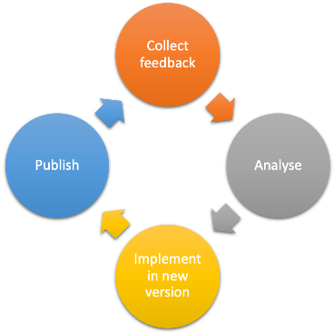

To keep up with the ever-changing environment, as well as the technological changes, continual improvement is considered to be one of the crucial phases in the learning materials development process. The implementation of continuous improvement increases the possibility to deliver successful training and produce adequate, accurate, up-to-date and high-quality learning materials. 

<figure markdown>
  
  <figcaption>Fig. 15 - Continual Improvement Implementation</figcaption>
</figure>

In many cases, the continual improvement process is an iterative process, with small and measurable steps and outcomes.
The model presented in Fig. 15 can be adapted to the needs of the FAIR-by-design methodology. The basic driver for the process should be the feedback gathered from the learners, as well as the usage of the learning objects by the community of other instructors. The gathered feedback should be continuously analysed and actions for improvement should be taken based on this analysis. 

In addition to traditional feedback analysis, the co-creation of learning materials can also be considered as a form of continual improvement. In this model, the learners are considered as partners in the creation and upgrading of the learning materials. Different methodologies exist to employ this model, as presented in [@R124]. 

Regardless of the way the feedback is analysed, the main goal of the continuous improvement stage is to identify clear goals on improvement. Once the goals are set, the FAIR-by-design workflow restarts aiming to produce new, updated and improved learning objects that will implement the envisioned goals. This restart will trigger the creation of a new version of learning materials. Historical versions should be kept for tracking purposes, and the versioning information should be clearly stated in the metadata for the improved materials. The feedback analysis at the end of the next cycle can be used to measure if the goals set for the new version have been successfully reached.

## [Review practical information on how to implement Continuous Improvement in the FAIR-by-Design Microlearning unit](https://fair-by-design-methodology.github.io/microlearning/latest/07%20Continuous%20Improvement/ci/)