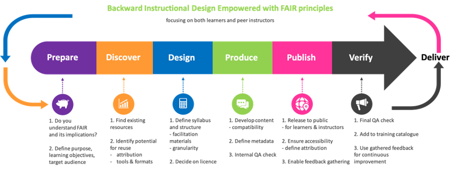

# FAIR-by-design learning materials creation

To ensure consistency in the process of preparation of FAIR learning materials, a methodology that will act as an overarching strategy for implementing a FAIR-by-design approach is necessary. In this way, a set of guidelines can be defined to systematically approach the development of FAIR learning materials. 

The proposed methodology outlined in this section builds on the previous work related to FAIR training materials, in particular [@R14], as well as the OER initiatives, aiming to take advantage of current best practices, experiences, guidelines and other acquired knowledge. It targets all activities related to the development of new learning materials by formally augmenting the traditional lifecycle of learning materials development (i.e. instructional design process) with additional aspects that will ensure the FAIRness of the resulting output. 

While this methodology is to be used by instructors, in particular instructional designers who prepare the learning materials, its outcomes (FAIR learning materials) are to be FAIR from both the instructor and learner perspective. That means that the FAIR learning materials are to be: 

- Easily findable by prospective learners (in the final consuming format) and other instructors (in the raw editable format);
- Accessible by learners and other instructors with all necessary descriptions and details available at the point of access;
- Interoperable in the sense of usable for consumption on different platforms for learners, and provided using standardised metadata, formats and tools to be used by other instructors;
- Re-usable by other learners outside the initial target group and by other instructors that would like to design new learning materials based on existing ones.

To achieve this goal a number of guidelines and recommendations need to be followed during the design process. A high-level overview of a learning materials design workflow incorporating these FAIR augmented steps is presented in Fig. 4. The main idea of the workflow is to implement the methodology by paying attention to the FAIR specific actions in each stage of the implementation of the well-accepted backward instructional design process.

<figure markdown>
  
  <figcaption>Fig. 4 - FAIR-by-design learning materials workflow</figcaption>
</figure>

