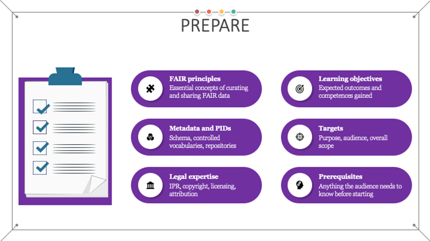

<figure markdown>
  
  <figcaption>Fig. 5 - Goals of the prepare stage</figcaption>
</figure>

Implementing the FAIR guiding principles for learning objects requires taking into account a number of aspects before starting the actual work on designing and then creating the learning objects (content and accompanying tools and resources). Thus, the first step is to understand what other expertise is required to ensure FAIRness of the produced materials in addition to the traditional learning materials production proficiency. Or, in other words, what are the specific skills that need to be obtained in order to successfully proceed with the instructional design of FAIR learning materials?

Aligned with the joint COL-UNESCO OER Basic guide to OER, that defines the skills requirements for work in OER [@R47], the skills required to start producing FAIR learning materials should include:

- Expertise in advocacy and promotion of the FAIR guiding principles;
- Expertise in curating and sharing FAIR data enabling:
    - Efficient application of the concept of metadata;
        - Choosing and implementing metadata schema with accompanying controlled vocabularies and ontologies;
    - Understanding the concept of storing and indexing learning objects:
        - Use of persistent identifiers (PIDs) for unique identification of the learning objects;
        - Use of learning objects repositories or learning management systems and platforms as the designated stores for learning objects;
- Legal expertise to be able to recognise, define and combine Intellectual Property Rights, licensing, attribution and citing of learning materials and other resources;
- Technical expertise in:
    - Different tools and formats used for creation and delivery of learning content and their interoperability;
    - Use of versioning during the creation and maintenance of different types of materials and resources;
- Good communication, collaboration and research skills that will support the process of co-creation, sharing, finding and reuse of learning materials and implementation of best practices and other related policies;
- Instructional design and development expertise [@R48] necessary for the creation of high-quality learning materials. 

While the last three points are to some extent “traditionally” required skills [@R49] when it comes to instructional design and development, the specific tasks and steps related to these activities need to be adapted and further extended so that different aspects of the FAIR principles are incorporated within.

## Expanding instructional design with FAIR related skills

Understanding the FAIR guiding principles [@R50] is an essential step towards the goal of managing FAIR learning materials. One of the essential concepts of curating and sharing FAIR data is the use of rich metadata description of all resources necessary to support findability and reusability. When it comes to the creation of FAIR learning materials, the designer needs to choose an appropriate metadata schema developed for the purposes of describing learning materials. To ensure maximum compatibility throughout the EOSC community, the use of the RDA minimum metadata schema for learning resources [@R34] is recommended. However, considering that this schema is still under development, one may still opt to use other existing schemas especially if the developed material is specific for a certain discipline, such as the Bioschemas option [@R32]. Once the metadata schema is chosen, its related controlled vocabularies should be studied so that the appropriate terminology is used in the design process. 

Related to the metadata used for describing learning materials are the concepts of using persistent identifiers (PIDs), storing and indexing of learning objects. To ensure FAIRness, it is required that, once the learning objects are created and offered for use and reuse, they should be assigned globally unique PIDs that will provide a long-lasting reference to the digital learning resource. These references should also be used when attributing reused learning materials. One general introduction to persistent identifiers can be found at [@R51]. 

The specific type of persistent ID to be used is very much related to the choice of where the learning materials are going to be stored and offered for access to learners and instructors. There are multiple choices available including general data repositories, learning objects repositories and/or learning management systems and platforms. These can be institutional, project-based, or public, and they can also be focused on generic or specific domain content.  Also, it is preferable that the chosen location for storing the learning materials is harvested (manually or automatically) by a relevant training catalogue. Having a catalogue entry greatly increases the findability and reusability of the learning material while reducing the concept of importing the same learning materials in multiple repositories or learning systems. Finally, it is good practice to make the choice of the location where the generated material will be stored in advance, as the destination may impose limitations to the type of materials supported, formats and tools used, etc.

The development of legal expertise in concepts such as Intellectual Property Rights (IPR), licensing, attribution and citing is another essential skill that needs to be acquired. The importance of understanding and applying these concepts is twofold: they play a major role in the process of selecting existing learning materials that can be reused during the creation of new learning materials, but also they are needed so that the newly created learning material can be offered for reuse to others. Some of the most important aspects that need to be clear at the beginning include:

- What is IPR [@R52]
    - Intellectual property refers to the creation of intellectual activity and IPR protects the interests of the creators and owners by providing them with rights over their creation. 
    - When it comes to the creation of learning materials, the copyright and related rights branches of IPR are used, defined to protect, i.e., literary and artistic creations, performances, phonograms, and define the authors’, owners’, performers’, producers’ and broadcasters’ rights [@R53].
    - Note that in the case of management of learning resources repositories, other related exclusive rights may also be of interest as is the case of Sui Generis Database Right (SGDR), which is different from the copyright protection granted to databases. According to the Directive 96/9/EC on the legal protection of databases, copyright protection will be granted to those databases which “by reason of the selection or arrangement of their contents, constitute the author's own intellectual creation” (art 3(1)). On the other hand, regardless of copyright protection, a database may be protected under the SGDR if it “shows that there has been qualitatively and/or quantitatively a substantial investment in either the obtaining, verification or presentation of the contents” (art 7(1)).
- How copyright defines exclusive rights and free uses 
    - Original work can be protected by copyright law that grants the owner exclusive right to control certain rights such as reproduction. The copyright is owned jointly by all authors, or it may be owned by the employing institution. 
    - Generally, use of copyright protected work requires permission from the owner.  In absence of exceptions or limitations, one can reuse an existing work if it is licensed to the user or it is licensed to the public using a public licence such as the Creative Commons (CC) licences [@R54] or Free-Libre / Open Source Software (FLOSS) [@R55] licences. 
- How to use licensing as a tool to enable reuse
    - One of the best sources of information for licensing reusable learning materials is Creative Commons. Their Licence Chooser tool [@R56] helps authors share their work in a standardised way providing copyright licences that enable sharing and reuse of the creative work under the chosen conditions. The available CC Licence options can be found at [@R57]. It is recommended that the least restrictive CC BY licence, requiring only that credit is given to the creator when reusing, is used when creating new learning materials. 
    - It is essential to understand that when reusing existing learning materials, one must ensure that the licences of the included and adapted materials are compatible with each other. For these purposes, the CC licence compatibility chart can be used [@R58].
- How to use attribution and citing
    - The right to attribution is a moral right of the authors that protects the personal relationship between the author and the created work even if the creator does not own the copyright.
    - Acknowledgement of the reused materials through attribution is always strongly recommended (even if it is not a requirement of the licence). On the other hand, one condition that is required for all CC licences is attribution. The ideal attribution should include the title, creator, source and licence. For more detailed instructions Creative Commons offer a wiki page with the Recommended practices for attribution [@R59].
    - Citing can be used for including and referencing restricted works with limited copyright. However, in the case of using direct quotations with citing, it is essential that the amount of information referenced is very limited. In addition, it is recommended to quote works that were already made available to the public in a lawful way and, when possible, to provide the original source and the author's name.  
        - Depending on the country, the reproduction and communication of a protected work may be carried out for the sole purpose of illustration for teaching or scientific research, as long as the source, including the author's name, is indicated, unless this turns out to be impossible and to the extent justified by the non-commercial purpose to be achieved [@R60].
    - Note that another moral right is the right of integrity which provides the author with the right to object to any modifications of the work that can be considered as prejudicial to the authors’ honour or reputation. Thus, even when reuse and modifications are permitted, they should be done in such a way that does not include a derogatory treatment of the work.

## Ideation of the FAIR learning materials

In addition to these newly developed skills, best practices for the instructional design process [@R61] emphasise that, in the initial preparation phase, there should be a clear definition of the overarching aspects and considerations related to the learning materials that are going to be created. In the FAIR-by-design methodology, these aspects should be expanded with additional considerations that might affect the FAIRness of the produced result:

- What is the purpose of the learning materials? This includes when and how the learning materials can be used and for what purposes they were initially developed, also known as primary use.
    - Once defined, the primary use may impose restrictions to the type, tools and formats of the created learning materials including the existing learning materials that might be reused (i.e. e-learning interactive content might be unsuitable for face-to-face or webinar learning settings). In some cases, the primary use might identify the delivery platform for the learning material in this initial preparatory step. If possible, the choice of a delivery platform should be postponed to the design step as to ensure that the choice is compatible with the types of learning objects identified for potential reuse.
- What are the learning objectives? What competences will be gained after successful completing of the learning process?
    - To ensure standardization and wide understanding of the defined learning objective, it is best practice to define the learning objectives using a well-known taxonomy such as the Bloom’s taxonomy [@R62]. This approach will significantly improve the findability of the produced resources, as well as the potential reuse of individual learning objects in different aggregations.
    - While traditional competences indicate what a person should know at the end of a study programme, the concept of microcredentials is used to certify the learning outcomes for short-term learning experiences. Thus, if applicable, it is recommended that the microcredentials are also defined at this stage. For more information about microcredentials please refer to the work of Task 2.4 in the Skills4EOSC project. In this way, it can be clear how the specific set of learning materials fit into a larger skillset, such as the minimum viable skillsets and profiles developed by Task 2.1 in the Skills4EOSC project.  
    - Note that to ensure the highest degree of reusability, each reusable learning object should have one well-defined learning objective. Multiple learning objectives should ideally be broken down into multiple learning objects.
- Who is the target audience? – is there a primary audience and is there anything specific that needs to be taken into account, such as localisation to cultural context or native language
    - The description of the target audience should follow the rules of the controlled vocabulary of the metadata schema that is going to be used. This approach will ensure consistent description of the learning material improving findability for both instructors and learners. 
    - Note that at the moment the RDA minimum metadata schema does not offer a controlled vocabulary for these purposes but does recommend its use [@R42].
- What is the overall scope of the learning materials? – is it going to be a single learning object, or an aggregation of some sort such as a course, or maybe a learning path
    - The overall scope of the learning materials defines its granularity and has a direct effect on its reusability. Ideally the creation of learning materials should be on the level of a learning object so that they can be reused as flexibly as possible. 
- Are there any prerequisites?  What does the audience need to know or understand before starting the learning process?
    - The prerequisites help position the learning materials in a wider context and define their place in a higher-level aggregation such as a learning path. Using a standardised, well-adopted vocabulary to describe the prerequisites helps other instructors better understand the learning content and how it can be fit together with other learning objects.
