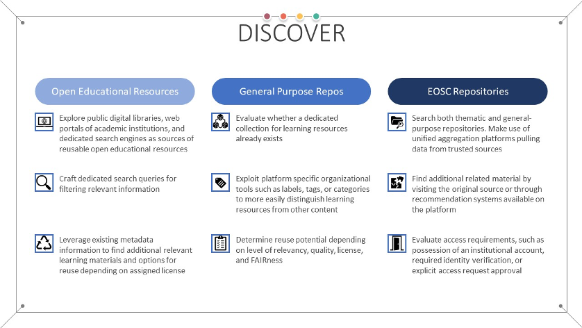

<figure markdown>
  
  <figcaption>Fig. 6 - Main goals of the discover stage</figcaption>
</figure>

Once the preparation phase has been completed, but before the design and development of new learning objects is undertaken, it is a recommended best practice to discover existing related learning materials. Depending on the subject area, vast amounts of learning resources might already exist. Such reusability is at the core of the FAIR principles, promoting the extension and improvement of existing work.

During the discovery process, it is expected that not all found material will be open and freely accessible. Should such non-open resources need to be incorporated into the design of the new learning objects, care must be taken to ensure that the material is at least FAIR, before making the final decision. In this context, it is very important that clear accessibility information should be provided by the resource, outlining its access rules and criteria. 

Recognizing the real-life benefits of sharing learning resources, a number of initiatives currently exist which facilitate the exchange of Open Educational Resources (OER). These initiatives range from public digital libraries dedicated to OER content, to standalone academic institutions with (in)formal policies on OER content distribution, and specialized search engines. OER Commons [@R64] is one such digital library which is built using the community model, where anyone is free to both download existing resources, as well as submit new ones. The USG (University System of Georgia) [@R65] and the OpenMichigan (University of Michigan) [@R66] portals are examples of institutional repositories for OER produced as part of the curricula in the respective universities. The majority of the content found in these institutional repositories is reuse friendly, licensed under a permissive Creative Commons licence. Finally, dedicated OER search engines have also been developed, which scour multiple digital libraries and institutional repositories for OER which match a given, user supplied, criteria. Examples in this area include the Mason OER Metafinder [@R67], the MERLOT search engine [@R68], OASIS [@R69], and OERTX [@R70]. Various different types of learning resources are indexed, such as: videos, podcasts, complete courses, digital textbooks, course modules, open access books, and supporting course materials. Even though not all indexed content might be open, search results can be limited through the use of explicit filters targeting specific licenses and access policies.

One of the added benefits of using digital OER repositories is the fact that they usually associate valuable metadata to the published learning resources. This metadata, apart from being related to the content at hand, can also serve an additional purpose, that of discovering related material. As mentioned previously, multiple metadata schemas, including the RDA schema extended with the proposed changes, include fields that can be used for content discovery, such as the "isBasedOn" and "isPartOf" fields. One such real-world example is the training portal of the Galaxy Project [@R71], which uses the BioSchemas' TrainingMaterial profile [@R72] to describe available resources. This profile contains the "isPartOf" field, allowing learning resources to specify the learning unit that they are part of [@R73].

Valuable learning materials can also be found in more general-purpose repositories, not intrinsically related to OER. Zenodo [@R74], [@R75] is a generic example which is also commonly used for publishing learning resources, with one reason being the allocation of a unique persistent identifier to each uploaded item in the form of a Digital Object Identifier (DOI). Additionally, dedicated search tools that can query thematic repositories which do not necessarily host learning resources themselves but might contain content beneficial to the development of learning resources can be exploited as well. FAIRsharing [@R76] is an example of such a search engine, which indexes FAIR-friendly databases.

Another valuable source of learning material which can be reused is the output of European research projects and initiatives. Many such projects, across different scientific disciplines, have created and published, under permissive licenses, material which can be incorporated or used as basis for future content. This material can either be found using dedicated search engines targeted at a specific scientific domain, or in certain cases, dedicated e-learning platforms that have been created as part of the project itself. The NI4OS Training Platform [@R40], OpenPlato [@R36], and EOSC Pillar [@R77] are such examples, primarily focused on the topics of open science, research data management, and FAIR practices. GoTriple [@R78] is another example of a search engine, but in this case dedicated to a different scientific area, that of social sciences and humanities. It can be used to find relevant research data, publications, and projects. For life sciences, the ELIXIR TeSS Platform [@R79] provides various relevant learning resources, including courses, videos, presentations, and handbooks. An alternative for physical sciences is the PaN EU Training platform [@R80]. For material primarily related to computer science topics, the EOSC-Synergy Training Platform can be used [@R81]. EOSC-Synergy also includes introductory courses to popular computer science concepts, tools, and services which can be of use in other subject areas as well. When it comes to arts and humanities, the DARIAH-Campus is a discovery framework and hosting platform that offers learning resources and training information related to these fields, but also some that are general [@R82]. The CESSDA portal is also offering a wide range of training materials [@R83] mostly on the topic of data management such as the Data Management Expert Guide [@R84] that focuses on how to make research FAIR together with the Managing and Sharing Research Data book [@R85]. The Carpentries project also offers the Carpentries Curricula that provides a list of reusable learning resources related to data carpentry and software carpentry [@R86]. 

No matter the source of the content, careful attention should be given to the associated metadata, licensing information, and their impact on the reuse and modification. The mentioned search engines and repositories either mandate content to be openly accessible and licensed under a permissive Creative Commons licence or contain explicit licensing information and access restrictions.
