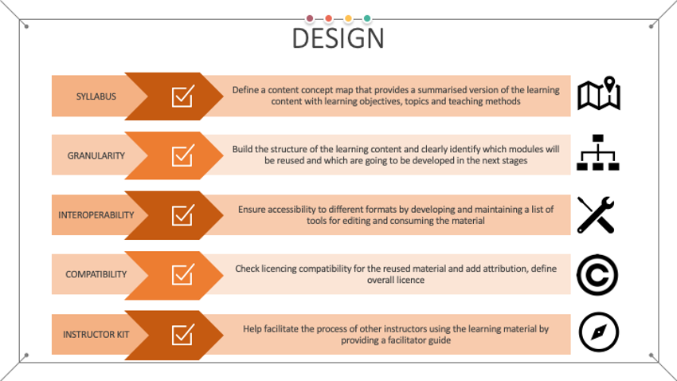
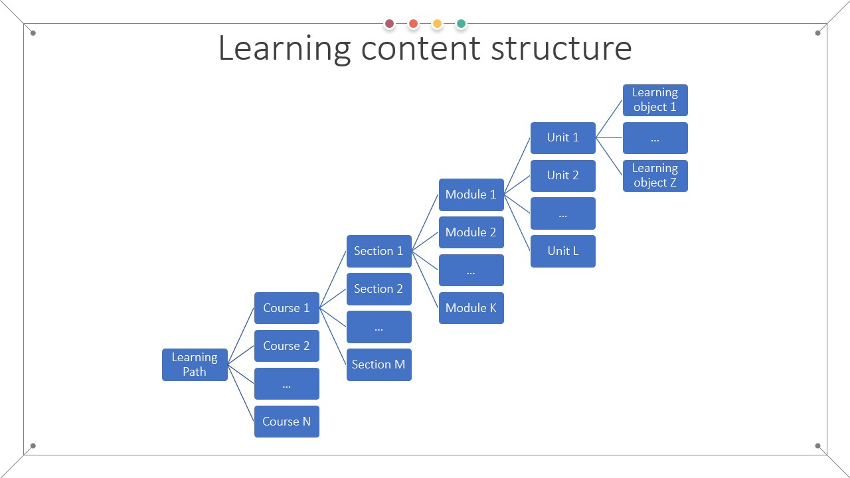
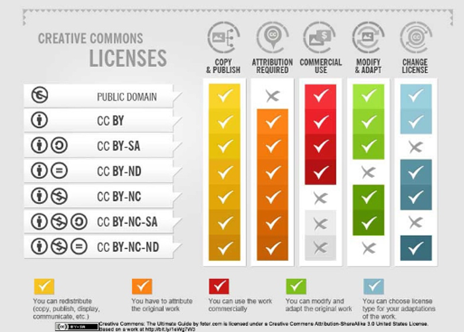

### Design

Once the learning objectives and target audience are defined, the discover step provides an opportunity to explore how learning materials with the identified or similar learning objectives are designed and implemented. This exploration enables the designer of the instructional materials to take into account different approaches and methodologies which:

- can serve as an inspiration, 
- can be used as additional or supporting materials, or 
- can be reused, in part or as a whole, as the main resources that will help learners achieve one or more learning objectives. 

The choices made need to be aligned with the plans on implementing assessment and evaluation, as they influence the selection of teaching methodologies and content type, making the design outcome oriented. An optimal strategy is to aim for building in a variety of different assessment techniques such as discussions and reflections, quizzes, simulations, projects, case studies, self and peer evaluations, etc. 
Following the stages of the backward instructional design process, during this third step of the methodology the syllabus, needs to be developed [R87]. The main goal of the syllabus, also known as the content concept map, is to provide a summarised version of the learning content, listing fundamental information with clear learning objectives, modules (or topics) that will be covered, and teaching methods employed. The programme needs to be tailored according to the needs of the identified target audience and aim. Best practices [R88] are to facilitate a rich learning experience by defining a modular structure that will be composed of the essential knowledge necessary to achieve the learning objectives augmented with additional resources for further elaboration for learners that are interested in obtaining more in-depth knowledge on a given topic. In summary, the course syllabus is a document that presents the purpose of the learning content with precise description of what is to be learnt, how and when under the assumption of the defined prerequisites. The Framework for Open and Reproducible Research Training (FORRT) offers a list of Open Science syllabi [R89] in various formats and detail level.

The defined syllabus can then be used as a blueprint to build the structure of the learning content and clearly identify which modules will be reused based on the output from the previous discovery step and which are going to be developed in the next stages. When building more complex, aggregated learning content, they should be organised in a corresponding group of smaller aggregates that decompose to the level of learning objects (Fig. 8).

The overall structure of an aggregated learning content, i.e. course or training, should include:

- Sections – each referring to one overarching theme, which are comprised of
- Modules – each with defined main goals, description and rationale, which are comprised of
- Learning units – each corresponding to one lesson with its specific objectives, activities and tasks, description of organisation and further reading, which are comprised of
- One or more learning objects – each with a well-defined learning objective.

Each module in this organisation should end with a module summary and a wrap-up activity, i.e. reflection and assessment, that will enable the learner feedback on whether the module outcomes have been achieved.

From a FAIR perspective, the adoption of existing learning materials in the final structure at this step will depend on:

- Granularity of the materials – if the material represents a higher-level aggregation it will be more difficult to incorporate into a specific structure. In this case, it should be investigated if it can be used in part with some modifications. This entails the requirements that the content is provided under a licence that allows derivations and modifications and having the appropriate tools and experience for editing the content.
- Interoperability – the selected existing learning materials may be provided in different formats and various tools may be needed to consume their content. The final choice must be done so as to ensure that the combined materials are interoperable and can be consumed by the learners. To achieve this, a list of all tools necessary to access the learning materials needs to be developed, ensuring that each tool on this list is accessible to the learners via the chosen method of delivery. Similarly, a list of tools for editing the materials need to be maintained for future reusability purposes.
- Adaptability – it is preferable to choose existing learning materials that are adaptable to various learning and technical contexts as they provide flexibility when reused in an alternative context or environment. This entails that the material will still make sense and fit well in other structures, not just the original structure and context for which it was produced.
- Licence compatibility – All chosen materials for reuse should be available under a licence that permits reuse in the way it is planned to be used (see Fig. 9 modify and adapt): for commercial use or not, with modification and adaptation permission or not.

For an example the CRI Open Science Course on Zenodo [R90] is offered as one editable document stating that it is adaptation of previous work at the top, while the Opensciency curriculum material on Zenodo [R91] is divided into five modules, each with its own set of contributors, making it easier to manage and reuse. 

When the final choices on reuse are made, the attribution for each of the reused learning materials should be defined and added to the information in the appropriate structure level (section, module, unit). This will not only ensure that licences are respected where attribution is required, but it will also promote transparency and ethical conduct by providing attribution. 

It is important to note that at this stage, the list of selected materials for reuse will also influence the overall licence of the produced FAIR learning materials (the final license of the learning object or higher aggregation, depending on the decision on which level the FAIR principles are to be applied). Thus, it is recommended that all licences are carefully checked, and an overall licence for the FAIR learning materials is chosen so that is aligned with the original licences of the reused materials as some licences do not allow changes (Fig. 9). When it comes to the Creative Commons Licences, this means that special attention is needed when the SA (Share Alike) configuration is present, restricting the use to the same licence. Another observation is that the ND (no derivative works) cannot be combined with SA, as SA applies to derivative works. Creative Commons provide a very good tutorial on the topic of remixing CC licensed work [R92]. To decide on the final license of the new learning materials that are developed by adapting existing materials the CC guidelines on choosing an adapter’s license should be followed.

When the reuse of existing learning materials does not constitute an adaptation then there is no requirement to apply SA even if reusing SA licensed work, as it is also allowed to reuse ND licensed work. In other words, CC allows combining CC licensed material with other as long as all reuses are attributed, and one complies with the NC directive when it applies.

Copyleft licences [R93] are another set of licences that provide the freedom to copy and share the work with others, together with the freedom to modify the work and distribute modified. However, in this case the work can only be distributed under the same or equivalent licence. Copyleft is mostly used for software, but it can be used on any type of work. Table 1 provides a generalised summary of the licensing specifics and restrictions of different types of licences that can be used for learning materials.

Table 1 - Generalised summary of different licenses (based on [R94])

|   | Copyright | Copyleft | Creative Commons |
|---|---|---|---|
| URL | https://www.copyright.eu/ | https://copyleft.org/ | https://creativecommons.org/ |
| What is a user allowed to do with the work? | What author/owner dictates | What user wants under certain rules | What user wants within the   licence restrictions |
| Clause of the use | As author/owner dictates | requires attribution to author   and copyleft | Requires attribution to author |
| Re-licencing | As author/owner dictates | Derivative work cannot be released as proprietary and should be   licensed under a copyleft licence  | Derivative work can be released   under another licence or as proprietary (as long as the share alike rules   don’t apply) |
| Commercial use | As author/owner dictates | Permitted when using the work as   a commodity tool or component to provide a service or product | Permitted for certain CC licence   types (as long as the non-commercial rules don’t apply) |

Note: it is strongly recommended to always check the terms of the specific licences, because they may provide additional/other obligations regarding the items addressed in this table.			

To be effectively reused, the learning materials should also be augmented with accompanying materials that comprise the so-called instructor kit, or facilitator guide [R95]. The kit is especially important for traditional learning settings (face to face), but also for hybrid and blended delivery of the learning material. Even in the case of online learning, there usually is an option for some type of interaction with the instructors, and the way this interaction is organised, its timing and frequency, scope and methods should be explained in the accompanying material. 

The instructor kit should help facilitate the process of other instructors using the learning material. Thus, a comprehensive instructor kit should contain the following information:

- How the material is structured in different sections, and what should be considered before starting and after completing each section (for example, ice breakers and reflections);
- Tips and tricks on how to make the delivery more effective based on the proposed teaching methodology;
- Best practices on the agenda (timing, pace, breaks) while covering the content;
- When to start and how to manage discussions;
- Organising and running different exercises;
- Room preparation and set-up, tools and props required (in case of physical delivery);
- A workbook that can be shared with the learners to be used as a study guide;
- Script/Notes that provide instructions what needs to be covered in each section;
- Assessment setup and questions;
- Step-by-step instructions on running exercises for a particular content together with handouts that should be provided to the learners;
- Other resources, such as feedback form or template certificate, attendance forms, etc.

An example comprehensive facilitator guide on how to organise face-to-face training events covering various logistics aspects is the TRIPLE Training Toolkit [R96].
