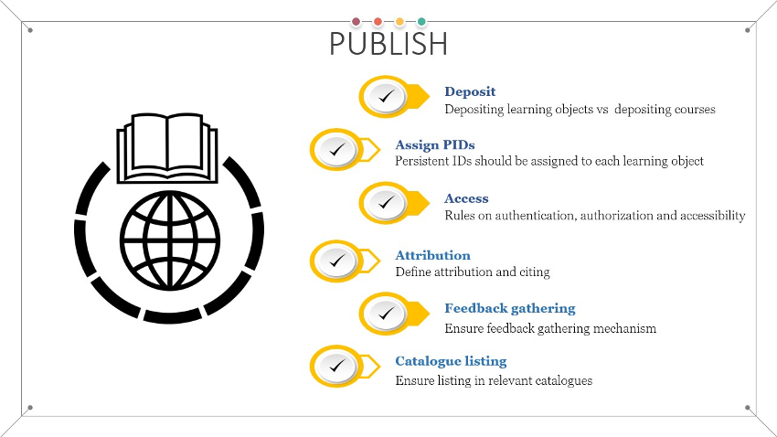

<figure markdown>
  
  <figcaption>Fig. 13 - Main goals of the publish stage</figcaption>
</figure>

The publishing phase of the workflow refers to the release of the produced learning objects and associated metadata. The publishing refers to both newly created learning objects and new versions of previously published objects. 

A clear distinction should be made between deposited learning objects and learning objects published as part of larger learning units, such as courses. The former should be deposited in relevant repositories [@R116], as separate deposits, preferably in source format (editable), while the latter are usually published on learning/training platforms. The main difference between the two is the target audience. The former target instructors/trainers to use/reuse the objects for producing learning materials, while the latter are mostly targeted toward the learners/trainees for consumption. 

Each deposited learning object should be accompanied by relevant metadata, providing information for its discovery, composition, and reuse, and appropriate persistent identifier [@R117]. 

One of the preferred platforms to host the editable (source) format of the learning objects for collaborative development can be GitHub, a well-known cloud-based platform for software development [@R118]. GitHub provides built-in visioning mechanism, enabling instructors to easily track the versions of the learning objects. However, while it does offer permanent storage, GitHub does not provide persistent identifiers for the hosted objects. To overcome this shortcoming, the integration between Zenodo and GitHub can be used. Once materials are created and/or added to a GitHub repository, the authors should navigate to Zenodo, use GitHub credentials for login and using the Zenodo GitHub page, archive the GitHub repository to Zenodo. The detailed procedure is described in [@R119]. Once the repository is archived to Zenodo, it will be assigned a persistent identifier (such as DOI). An example that has already implemented this integration between GitHub and Zenodo is the Opensciency curriculum [@R91] discussed previously. The snapshot of the GitHub repository at the moment of publication is offered in the form of a zip archive on Zenodo. The preview provides the file structure of the archive.

Given that learning objects should be granular and disassociated from the context as much as possible, as well as to provide easier reuse the deposition in learning object repositories, such as ones given in this list [@R120], depositing learning objects in repositories should be done in a flat model, avoiding any hierarchical approach that would potentially hide some learning object within a given context. On the other hand, learning objects that are composed in higher level elements, such as courses, published on learning platforms and offered for consumption by learners, should be done in a more hierarchical manner, depending highly on the context. 

Even though the goal of FAIR training material is to be widely accessible, in some cases access rules must be defined, in the form of who has access (authentication) and to what objects (authorisation). Access rules should be assigned consistently. When combining learning objects with different accessibility rules, the most restrictive rules should be clearly stated during the publishing phase. Based on the FAIR principles, it must be assured that the learning materials are "available at the point of access". This means that they should be searchable and findable, based on the metadata description, and the search result should provide a landing page with all details about the learning materials, including how to get access if they are not open, cost and alike.

At this stage the attribution for the learning materials should be provided so that it can be used if someone else decides to reuse the provided materials. Again, special consideration should be given when simply compiling higher lever learning materials out of existing individual learning objects that have different attributions. In this case, the attribution should note that it refers to the activity of gathering and organising existing materials. In cases when there is a mix of original content and existing learning objects, then the overall attribution refers to the new author(s), while for each reused part clear attribution to the original author should be provided. 
Once the materials are published and made available to the public, there should be mechanisms in place that will enable gathering feedback about their use. Collecting feedback on the published learning materials is key to implementing continual improvement. The exact type of feedback collection should heavily depend on the way the learning materials are presented to the users/learners. 

In face-to-face (f2f) sessions, feedback can be collected during the delivery of the training and after it. Interactive feedback collection can be more valuable, since the opinions of the learners are collected as they perceive the learning materials. 

For online published materials, feedback is usually collected post-festum, after the learner completes a given unit of learning objects. 
Another aspect of feedback gathering related to the feedback from the community of instructors/trainers that use the provided learning materials to augment their own trainings or to develop their own learning materials. It is encouraged to enable at least one channel of communication (it can be as simple as a request for feedback via email) that will enable the creator receive feedback from the community on the level of reusability of the offered learning materials. This effort can not only lead to producing higher quality learning materials by employing the continuous improvement loop, but also to building a strong community of instructors that can work closely together when producing new learning materials.

To make the learning materials more easily findable, after publishing in the relevant repository and learning platform, they should also be listed in relevant training catalogues. The catalogue entry can be done manually, or it can be created by an automated harvester that indexes the particular repository or learning platform. As discussed in the discovery stage, there are different catalogues available: thematic, national, regional, project-based etc. At the moment there is a significant amount of work in the EOSC related projects, led by EOSC Future, aiming to implement training catalogue aggregation of all diverse types of training catalogues into one master EOSC training catalogue [@R41]. This type of catalogue aggregation will simplify the findability of training materials for the end-users, giving them (ideally) a single point of access to various learning objects.
