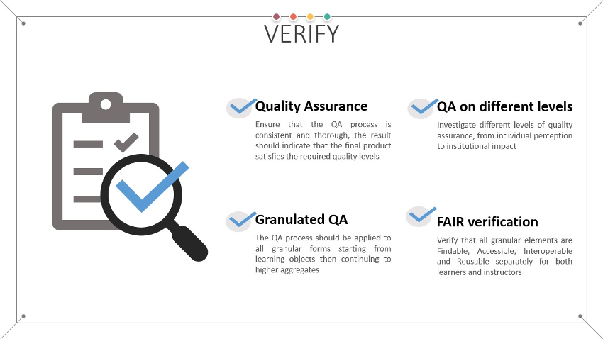

### Verify

<figure markdown>
  
  <figcaption>Fig. 14 - Main goals of the verify stage</figcaption>
</figure>

Quality Assurance checking of the produced learning materials should be performed consistently and thoroughly to ensure that the final products satisfy the required quality levels. After the internal QA check that was aimed at ensuring that all necessary materials are consumable by the target audience, upon publishing it is necessary to ensure the full QA spectrum for the learning materials. In essence this means double checking everything that was performed in the internal QA check but now in a production environment assuming the role of a leaner/instructor/interested party.

During the verification stage various aspects of quality assurance for the learning materials should be analysed. One of the frequently used approach for this goal is the Kirkpatrick model [@R121], consisting of the following levels:

- Level 1: Participant Reaction;
- Level 2: Learning;
- Level 3: Job Impact;
- Level 4: Business Impact.

In this model, the first 2 levels impact the learner him/herself, while the latter two levels impact the organization that the learner belongs to. 

Specific quality assurance activities can be performed on the learning objects as well as on the higher levels of granularity [@R122]. Example traditional QA checklists can be found in [@R122] and [@R123]. Additional information on quality assurance can also be found in the outputs from Task 2.4 in the Skills4EOSC project.

The FAIR aspects that also need to be verified at this point include:

- Findability - can the content be found on the platform/repository, using a catalogue, or even better, a general-purpose search engine;
- Accessibility - can the learner/instructor access all descriptive details related to the learning materials, are access rules clearly stated, are they correctly implemented;
- Interoperability - standardised metadata description is used for the learning materials based on standardised vocabularies; easy to use, widely available tools are needed to consume the content; standardised editable formats are provided for other instructors;
- Reusability - learners can share the content (under permissive licence) with other peers; other instructors can reuse (as a whole or in part) the content together with a comprehensive facilitators guide while developing their own learning materials under the rules defined with permissive licence (guidance on attribution is provided).

To ensure wide audience reach, this step should also include a final accessibility check that can be performed with document specific check tools as discussed in the accessibility section.

The analysis of already gathered feedback can also help at this stage to verify the QA levels and if all FAIR aspects are implemented as expected.

The ELIXIR FAIR training team is currently working on FAIR checklist and maturity model that can help with the implementation of the FAIR verification. The initial version of these guides are expected to be published soon as part of the ELIXIR FAIR Training Handbook [@R11].
Within Skills4EOSC, task T2.4 is working on certification and quality assurance and, as part of this work, is developing a quality assessment framework that will enable evaluation of the overall quality of the produced learning materials, and also their FAIRness and alignement with the FAIR-by-design methodology.
