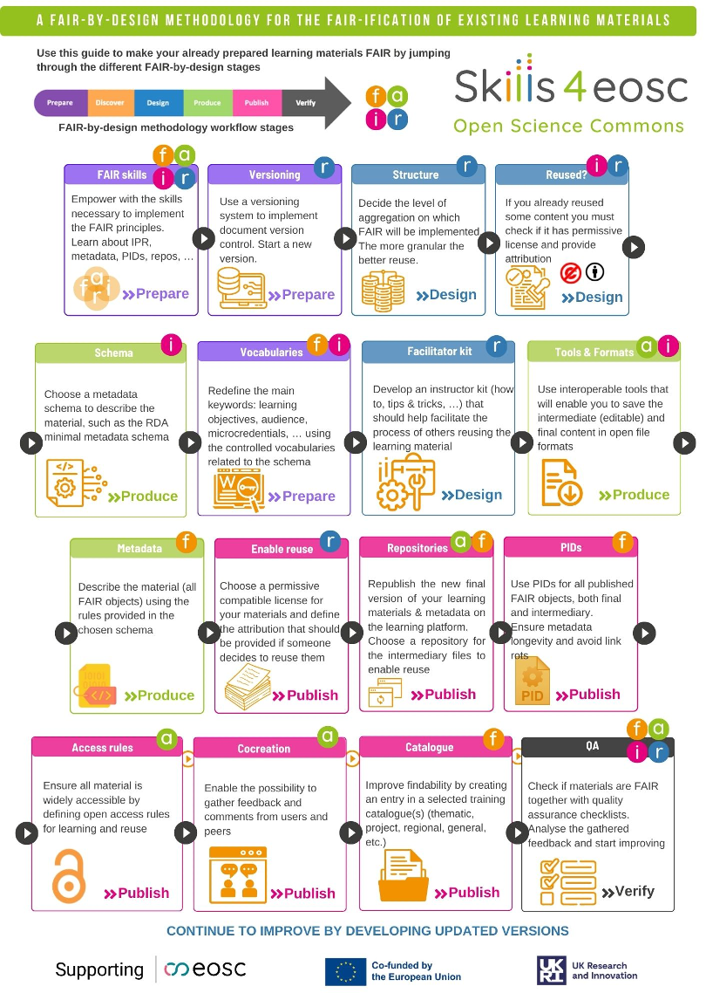

If the instructor has existing learning materials that need to be made FAIR then the following guide visualises how to use the proposed methodology for the purposes of FAIR-ification of existing learning materials.

Please note that when it comes to FAIR-ification of existing learning materials, the Discover stage has been omitted as it has already been completed while developing the initial version of the learning materials. This checklist assumes that no new content will be added to the existing learning materials. If a completely new version of the materials is being developed with content being added/removed/modified then the full methodology and checklist should be followed during the new version development process. 