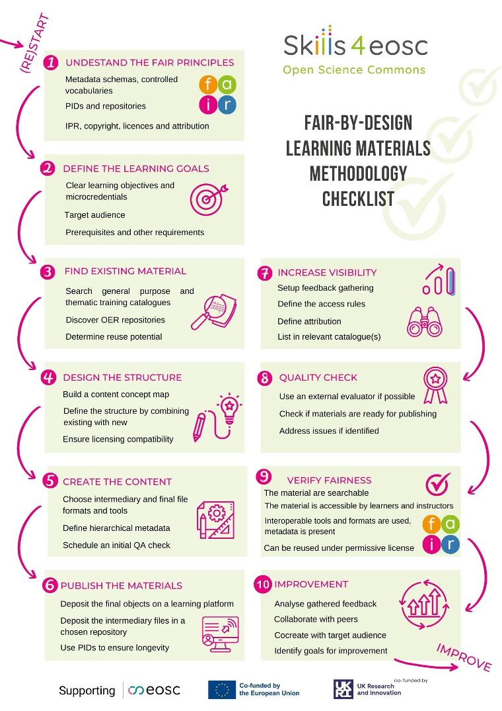

# FAIR-by-Design Interactive map

Click on the steps to jump to the part of the methodology that describes the step.

<map name="mapa">

<area shape="rect"
		coords="65,80,360,210"
		href="https://fair-by-design-methodology.github.io/FAIR-by-Design_Book/4%20-%20FAIR-by-design%20learning%20materials%20creation/4.1%20-%20Workflow%20stages%20description/411-prepare/#expanding-instructional-design-with-fair-related-skills"
		alt="UNDERSTAND THE FAIR PRINCIPLES"
		title="UNDERSTAND THE FAIR PRINCIPLES"/>
<area shape="rect"
		coords="65,235,360,360"
		href="https://fair-by-design-methodology.github.io/FAIR-by-Design_Book/4%20-%20FAIR-by-design%20learning%20materials%20creation/4.1%20-%20Workflow%20stages%20description/411-prepare/#ideation-of-the-fair-learning-materials"
		alt="DEFINE THE LEARNING GOALS"
		title="DEFINE THE LEARNING GOALS"/>		
<area shape="rect"
		coords="65,390,360,525"
		href="https://fair-by-design-methodology.github.io/FAIR-by-Design_Book/4%20-%20FAIR-by-design%20learning%20materials%20creation/4.1%20-%20Workflow%20stages%20description/412-discover/"
		alt="FIND EXISTING MATERIAL"
		title="FIND EXISTING MATERIAL"/>	
<area shape="rect"
		coords="65,550,360,680"
		href="https://fair-by-design-methodology.github.io/FAIR-by-Design_Book/4%20-%20FAIR-by-design%20learning%20materials%20creation/4.1%20-%20Workflow%20stages%20description/413-design/"
		alt="DESIGN THE STRUCTURE"
		title="DESIGN THE STRUCTURE"/>		
<area shape="rect"
		coords="65,710,360,840"
		href="https://fair-by-design-methodology.github.io/FAIR-by-Design_Book/4%20-%20FAIR-by-design%20learning%20materials%20creation/4.1%20-%20Workflow%20stages%20description/414-produce/"
		alt="CREATE THE CONTENT"
		title="CREATE THE CONTENT"/>		
<area shape="rect"
		coords="65,860,360,1000"
		href="https://fair-by-design-methodology.github.io/FAIR-by-Design_Book/4%20-%20FAIR-by-design%20learning%20materials%20creation/4.1%20-%20Workflow%20stages%20description/415-publish/"
		alt="PUBLISH THE MATERIALS"
		title="PUBLISH THE MATERIALS"/>		

<area shape="rect"
		coords="390,390,695,525"
		href="https://fair-by-design-methodology.github.io/FAIR-by-Design_Book/4%20-%20FAIR-by-design%20learning%20materials%20creation/4.1%20-%20Workflow%20stages%20description/415-publish/#list-in-relevant-catalogues"
		alt="INCREASE VISIBILITY"
		title="INCREASE VISIBILITY"/>	
<area shape="rect"
		coords="390,550,695,680"
		href="https://fair-by-design-methodology.github.io/FAIR-by-Design_Book/4%20-%20FAIR-by-design%20learning%20materials%20creation/4.1%20-%20Workflow%20stages%20description/416-verify/"
		alt="QUALITY CHECK"
		title="QUALITY CHECK"/>		
<area shape="rect"
		coords="390,710,695,840"
		href="https://fair-by-design-methodology.github.io/FAIR-by-Design_Book/4%20-%20FAIR-by-design%20learning%20materials%20creation/4.1%20-%20Workflow%20stages%20description/416-verify/#qa-of-the-fairness-of-the-learning-materials"
		alt="VERIFY FAIRNESS"
		title="VERIFY FAIRNESS"/>		
<area shape="rect"
		coords="390,860,695,1000"
		href="https://fair-by-design-methodology.github.io/FAIR-by-Design_Book/4%20-%20FAIR-by-design%20learning%20materials%20creation/4.2%20-%20Continuous%20Improvement/417-improvement/"
		alt="IMPROVEMENT"
		title="IMPROVEMENT"/>		

</map>
